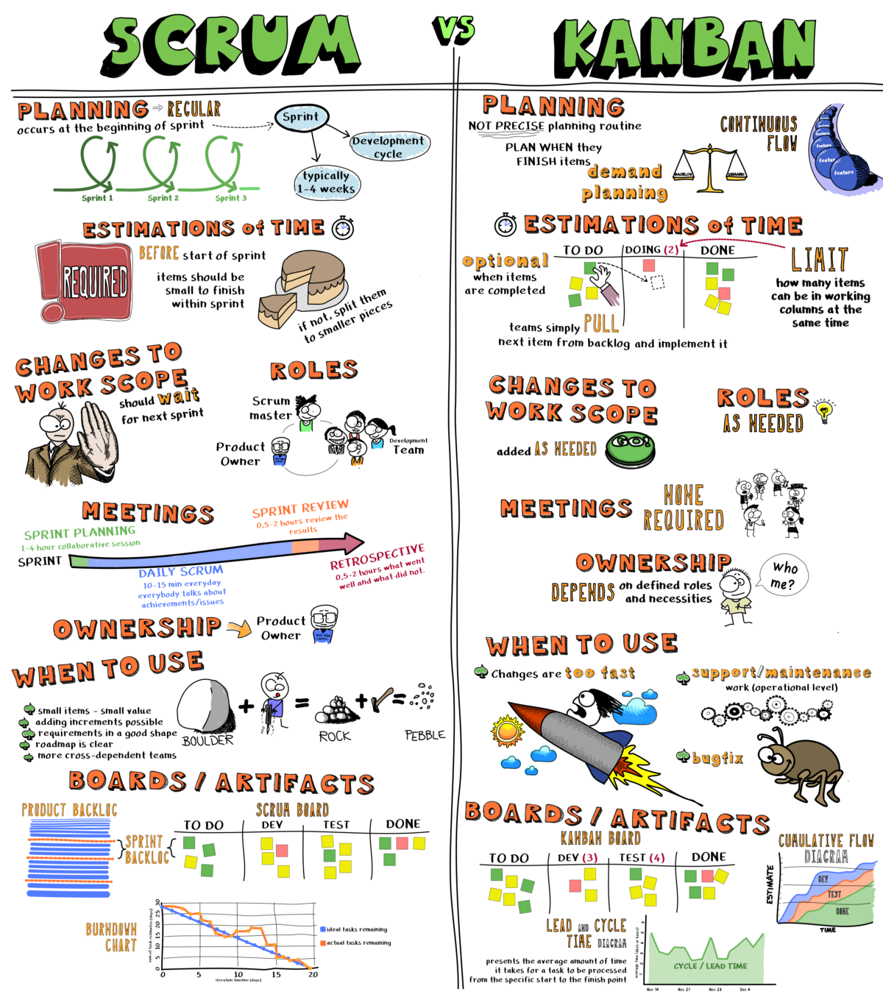
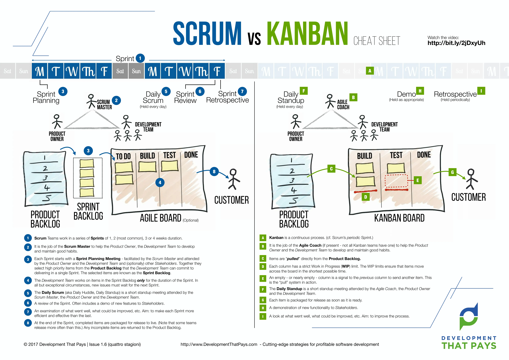
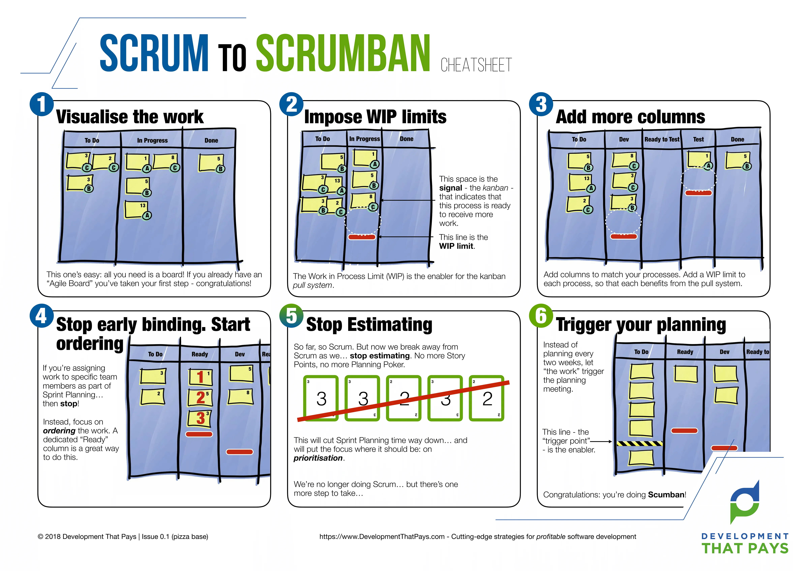

# General SDLC

Software/System Development Life Cycle

1. Analysis / Planning
2. Design
3. Development
4. Testing & integration
5. Deployment / Release / Production
6. Maintenance / Support

## Main SDLC models

- Agile: Uses cyclical, iterative progression to produce working software
- Waterfall: Follows a sequential model of phases, each of which has its own tasks and objectives
- Cleanroom: A process model that removes defects before they cause serious issues
- Incremental: Requirements are divided into multiple standalone modules
- V-Model: Processes are executed sequentially in a V-shape (each step comes with its own testing phase)
- Prototyping: A working replication of the product is used to evaluate developer proposals
- Big Bang: Requires very little planning and has no formal procedures; however, it's a high-risk model

### 4 values of the Agile Manifesto include

- Individuals and interactions over processes and tools
- Working software over comprehensive documentation
- Customer collaboration over contract negotiation
- Responding to change over following a plan

#### The Twelve Agile Manifesto Principles

1. Satisfy the customer
2. Don’t be afraid of change
3. Deliver working versions frequently
4. Bring business people and “techies” together
5. Motivate, trust, and support your team
6. Engage in face-to-face conversation
7. Measure progress with working versions of the final product
8. Encourage sustainable development
9. Pay attention to technical excellence and good design
10. Keep it simple
    1. Minimizing work that doesn’t add value.
    2. Going with the simplest design and adding on features later.
    3. Looking for ways to do more with less.
11. Use self-organizing teams
12. Regularly reflect and review

> More verbose description [source](https://afrebo-com.ngontinh24.com/article/the-agile-software-development-life-cycle-what-is-agile-sdlc-and-how-to-use-it)

### When to Choose Agile

- You don't have a concrete timeline or fixed budget
- They don't know all of the requirements
- You don't have a complex bureaucracy that would delay decision-making
- You need to capture the market quickly

#### Agile Methodologies aka frameworks

- Kanban
- Scrum
- Extreme Programming (XP)
- Feature-Driven Development
- Crystal
- Lean
- Dynamic Systems Development Method
- hybrid: Scrum + Kanban = Scrumban

#### Phases of Agile SDLC

##### Scrum vs. Kanban

Scrum
> Divides a project into short iterations, usually between 1 – 4 weeks in length. Each iteration is called a "sprint". The Scrum Master leads the team, and they work together to deliver an iteration at the end of each Sprint. A Scrum team boosts collaboration and discusses progress during daily standup meetings, and they use a Scrum Board to manage and monitor their project.

Kanban
> Focuses on visualizing work, limiting the amount of work in progress, and maximizing flow. The team uses a Kanban board, which is broken down into visual signals (sticky notes, tickets), workflow columns (to-do, progress, complete), work-in-progress limits, a backlog section, and a delivery point.

###### What Agile flavor to choose?

More details in article [Agile : Scrum, Kanban & Scrumban](https://medium.com/@shehanb/agile-scrum-kanban-scrumban-cheatsheet-sprint-artifacts-ceremonies-software-jira-trello-scrumage-pmbok-e669d5dbf6f3)

All these methodologies aren’t prescriptive. High-performing teams discover what works for them and flex the system appropriately.

###### Scrumban

It is seems that Scrumban is good choice for current project.

###### Software for backlog, workflow visualization and metrics

- GitHub Projects
- JIRA
- Trello
