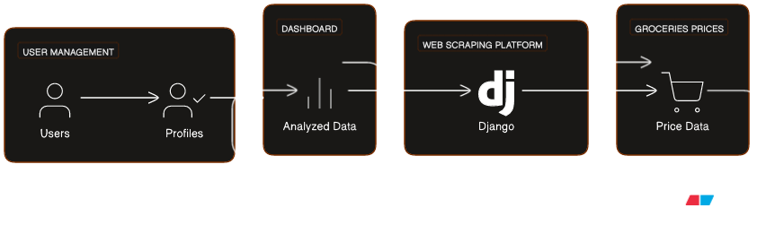
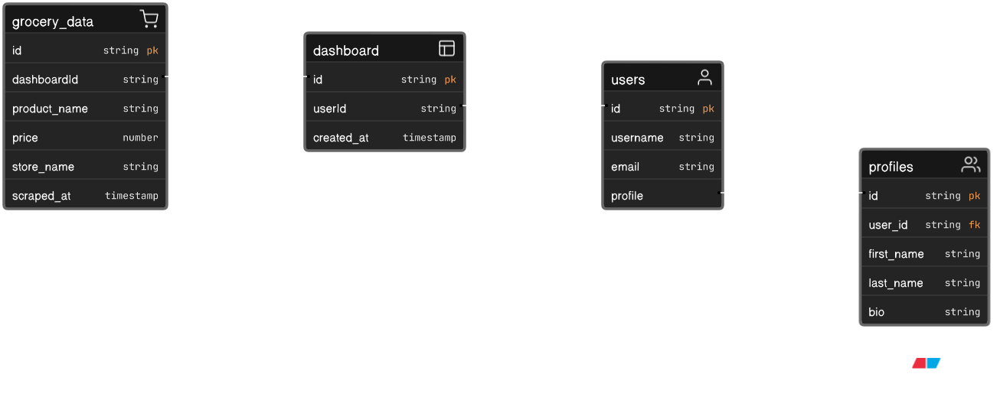

# Project --verbose details

[Requirements](#requirements)

[Installation](#installation)

[Project structure](#project-structure)

[System design and architecture](#system-design-and-architecture)

[Tech Stack](#tech-stack)

[Useful resources](#useful-resources)

[Credits and gratitude](#credits-and-gratitude)

(#requirements)=
## Requirements

- Knowledge of your operating system: basic commands and utilities to perform common tasks, such as file management, process management, user management, etc.
- IDE or "text editor on steroids" ^_^
- Knowledge and desire to learn modern browsers DevTools: page inspector, console, sources, network, application and other tabs
- [CPython 3.10+](https://www.python.org/downloads/)
- [NodeJS](https://nodejs.org/en/download) / `npm`
- [Git](https://git-scm.com/downloads), [GitHub account](https://github.com/) / [GitHub CLI](https://cli.github.com/)
- [Docker Engine](https://docs.docker.com/engine/install/), [Docker Compose v2](https://docs.docker.com/compose/)
- Databases servers (for local development w/o containers)
  - [PostgreSQL](https://www.postgresql.org/download/)
  - other
- Cloud services
  - AWS
    - [Active account](https://aws.amazon.com/) with free tier/enabled billing
    - AWS CLI [installed](https://docs.aws.amazon.com/cli/latest/userguide/getting-started-install.html) and [configured](https://docs.aws.amazon.com/cli/latest/userguide/cli-chap-configure.html)
  - GCP
    - [Active account](https://cloud.google.com/) with free tier/enabled billing
    - GCP CLI [installed](https://cloud.google.com/sdk/docs/install)
  - Azure
    - [Active account](https://azure.microsoft.com/en-us/) with free tier/enabled billing
    - Azure CLI [installed](https://learn.microsoft.com/en-us/cli/azure/)

(#installation)=
## Installation

Check README.md page in project root for local and containerized setup

(#project-structure)=
## Project structure

    price_navigator/
        ├── manage.py
        ├── config/
        |   ├── settings
        |       ├── __init__.py
        |       ├── base.py
        |       ├── local.py
        |       ├── production.py
        |       ├── test.py
        │   ├── __init__.py
        │   ├── asgi.py
        │   ├── api_router.py
        │   ├── urls.py
        │   └── wsgi.py
        └── price_navigator/
                ├── static/
                ├── templates/
                ├── utils/
                ├── __init__.py
                ├── conftest.py  # pytest's fixtutes
                ├── users/
                    ├── api/
                    ├── migrations/
                    ├── tests/
                    ├── __init__.py
                    ├── admin.py
                    ├── apps.py
            ├── models.py
            ├── models.py
            ├── tests.py
                    ├── models.py
            ├── tests.py
            └── views.py
            └── views.py
:::
                    └── views.py
:::

(#system-design-and-architecture)=
## System design and architecture

(#tech-stack)=
## Tech Stack

In terms of _layers_:

"Backend Burger"

1. **Containerization**: Docker, Docker Compose
2. **Architectural patterns**: Monolithic
3. **CI/CD Tools**: GitHub Actions
4. **APIs**: RESTful API
5. **VCS**: GitHub
6. **Caching**: Browser cache, CDN
7. **Frameworks**: Django
8. **Programming language**: Python
9. **Testing**: Unit testing
10. **Database**: RDBMS (PostgreSQL), NoSQL (Redis as message broker)
11. **Third-party integrations**: email, open-source maps API

"Frontend Burger"

1. **Responsive, interactive, and dynamic web interface**: HTML5 (structure), CSS3 (style), behavior (JavaScript)
2. **Interactive visualizations**: JS libs

In terms of _technologies_:

1. **Environment setup**: shell scripts, Makefile, Docker, Docker Compose, Kubernetes
2. **Backend**: Python 3.10, Django 4.2
3. **API**: Django REST Framework, Websockets, Swagger/OpenAPI
4. **Databases servers/Docker images**: PostgreSQL, Redis, MongoDB, Cassandra
5. **Data analysis**: Pandas, NumPy, Matplotlib, Seaborn, or Plotly
6. **ETL pipeline**: Airflow
7. **Web scraping**: requests, BeautifulSoup, or Scrapy
8. **Code quality**: linters, formatters, security scanners, git hooks
9. **Testing**: Pytest, pytest-django, locust, coverage, TDD
10. **Security**: pay attention to
    - CORS
    - CSRF
    - environment variables/password/secrets management
    - Content Security Policy (CSP)
    - XSS
    - Django deployment check list
11. **UI**: HTML, CSS, JavaScript
12. **Documentation**: Markdown, reStructuredText
13. **Cloud hosting/PaaS**: AWS (EC2, S3, CloudWatch)
14. **IaaC**: Terraform or Ansible

In terms of detailed list of _dependencies/packages/libraries_:

1. Check `requirements.txt` / `pyproject.toml` / `package.json`

In terms of _tech skills / practical knowledge / experience with_:

1. Design patterns and SOLID principles
2. Data structures and algorithms
3. Experience with Python web frameworks both sync and async
4. Implement various ways of communication with client (e.g. REST API, WebSockets)
5. Implement various ways of authentication (e.g. JWT, cookie-based auth, OAuth)
6. Experience and development on different data stores (RDBMS, NoSQL, KeyStore, etc.)
7. Experience in databases optimization: indexing, query tuning, execution plans, normalization
8. Proficiency in testing
9. Experience with CI/CD, deployment tools
10. Cloud platforms (AWS/GPC/Azure) and their core services

In terms of _soft skills_:

1. Good communication skills and at least an Upper-Intermediate level of English
2. Energetic team player
3. Highly motivated, self-driven, and independent

In terms of _responsibilities_:

1. Clarifying requirements and advising on the technical approach
2. Developing site parsers and performing data cleaning and transformation
3. Maintaining, configuring, and improving integration with various third-party services
4. Ensuring coding quality and maintainability of development
5. Code review
6. Communicating with cross-functional teams that develop applications
7. Managing priorities, deadlines, and deliverables

In terms of _typical developer tools_:

1. VS Code as IDE
2. VS Code extensions:
   1. API Client: Thunder Client
   2. SQLTools
   3. PostgreSQL Management Tool
   4. ShellCheck
   5. Remote Development
   6. markdownlint
3. `.editorconfig` to maintain consistent coding styles for multiple developers
4. Browsers' Web Developer tools
5. shell alias for Git commands
6. cheat sheet of most common/oftenly used shell/CLI commands

(#useful-resources)=
## Useful resources

1. **Base/core**:
   1. <https://docs.python.org/3/>
   2. <https://docs.djangoproject.com/en/4.2/>
   3. <https://docs.docker.com/>
2. **Handy web services/tools**:
    1. <https://regex101.com/>
    2. <https://jsonformatter.curiousconcept.com/>
    3. <https://www.sql-practice.com/>
    4. <https://caniuse.com/>
    5. <https://www.eraser.io/diagramgpt>
3. **Particular topics**:
   1. <https://www.buchanan.com/database-performance-tuning-techniques/>
   2. <https://www.digitalocean.com/community/tutorials/how-to-secure-your-django-application-with-a-content-security-policy>
   3. <https://www.laac.dev/blog/content-security-policy-using-django/>
4. **General articles/blogs/books**
   1. <https://bytebytego.com/courses/system-design-interview/foreword>
   2. <https://www.startdataengineering.com/>
5. **Inspiration/templates**
    1. <https://awesomedjango.org/>
    2. <https://github.com/donnemartin/system-design-primer>
6. **Other/pile of links**
   1. <https://www.testgorilla.com/glossary/>
7. **Optimization**
   1. <https://www.citusdata.com/blog/2020/05/20/postgres-tips-for-django-and-python/>
   2. <https://adamj.eu/tech/2022/06/21/optimize-postgresql-queries-from-django-using-pgmustard/>
8. **Troubleshooting and debugging**
   1. <https://stackoverflow.com/questions/26598738/how-to-create-user-database-in-script-for-docker-postgres>

(#credits-and-gratitude)=
## Credits and gratitude

1. <https://github.com/erayerdin/sos-django-template>
2. <https://github.com/jefftriplett/django-startproject>
3. <https://github.com/cookiecutter/cookiecutter-django/>
